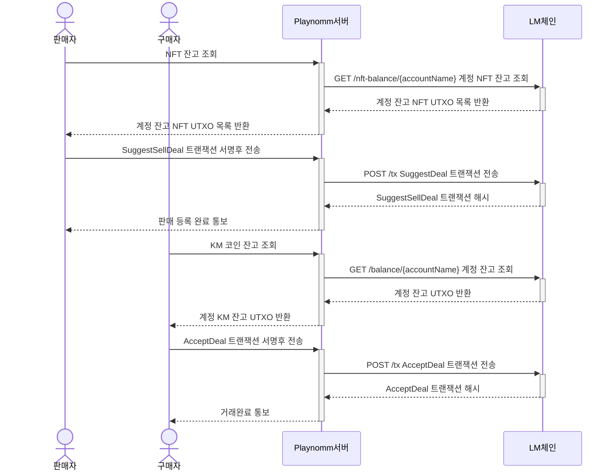
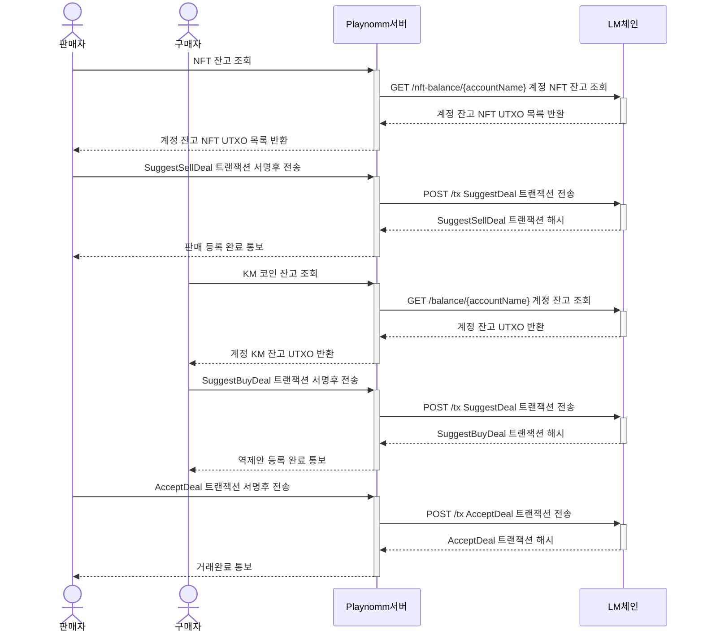
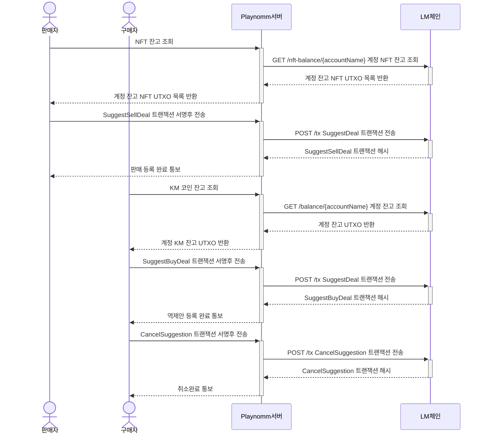

# LeisureMeta Chain API

## API with Top Priority

`GET` **/balance/{accountName}** 계정 잔고 조회

> `param` *(optional)* movable: 잔고의 이동 가능성 여부
>
> * 'free': 유동 자산
> * 'locked': 예치 자산

*  Response: Map[TokenDefinitionID, BalanceInfo]
  * Token Definition ID: 토큰 정의 ID (string)
  * BalanceInfo
    * Total Amount: 해당 토큰 총 금액/수량 (NFT의 경우 랜덤박스 갯수)
    * Array[TxHash]: 사용하지 않은 트랜잭션 해시 목록

`GET` **/nft-balance/{accountName}** 계정 NFT 잔고 조회

*  Response: Map[TokenDefinitionID, Map[TokenID, UTXO Hash]]
  * Token Definition ID: 토큰 정의 ID (string)

`GET` **/reward-expectation/{accountName}** 예상 보상량 조회

* Response: Map[RewardType, RewardAmount]
  * RewardType: 보상 유형 (string). 다음 네 가지 중 하나이다.
    * "Basic": 기본적인 NFT 보유 보상
    * "Rarity": 보유한 NFT의 Rarity에 따르는 추가 보상
    * "Activity": DAO 활동 보상
    * "Staking": LM토큰을 스테이킹했을 때 주어지는 보상

  * RewardAmount: 해당 유형의 보상 총량

`GET` **/reward/{accountName}** 보상 조회

> `param` *(optional)* timestamp: 기준 시점. 없으면 가장 최근 보상.

* Response:
  * value: Map[RewardType, RewardAmount]. 예상 보상량 조회의 응답과 같은 타입의 object이다.
  * rewardedAt: 보상된 시각

`GET` **/nft-reward/{tokenId}** NFT별 주별 예상 보상량 조회

* Response: RewardAmount
  * RewardAmount: 보상 총량

`GET`  **/dao/{groupID}** 특정 그룹의 DAO 정보 조회

* Response: DaoInfo DAO 정보
  * DaoInfo 현재까지 정해진 필드값들
    * NumberOfModerator: 모더레이터 숫자

`GET`  **/owners/{definitionID}** 특정 컬렉션 NFT들의 보유자 정보 조회

* Resoponse:
  * Map[TokenID, AccountName]

`POST` **/tx** 트랜잭션 제출

* 아래의 트랜잭션 목록 참조
* Array로 한 번에 여러개의 트랜잭션 제출 가능

### Response HTTP Status Codes

* 요청했을 때 해당 내용이 없는 경우: 404 Not Found
* 서명이 올바르지 않은 경우: 401 Unauthorized
* 트랜잭션이 invalid한 경우: 400 Bad Request
* 블록체인 노드 내부 오류: 500 Internal Server Error

## User Transactions

* 모든 트랜잭션 공통 필드
  * "networkId": 다른 네트워크에 똑같은 트랜잭션을 보내는 것을 막기 위한 필드. 
  * "createdAt": 트랜잭션 생성시각
* Format
  * 서명주체
  * Fields: 트랜잭션을 제출할 때 포함시켜야 하는 필드 목록
  * *(optional)* Computed Fields: 블록에 기록될 때 노드에 의해 덧붙여지는 필드들

### Account

* CreateAccount 계정 생성
  * > 사용자 서명
  * Fields
    * account: Account 계정 이름
    * guardian: *(optional)* Account
      * 계정에 공개키를 추가할 수 있는 권한을 가진 계정 지정. 일반적으로는 `playnomm`
  
* AddPublicKeySummaries 계정에 사용할 공개키요약 추가
  * > 사용자 서명 혹은 Guardian 서명
  * Fields
    * account: Account 계정 이름
    * summaries: Map[PublicKeySummary, String]
      * 추가할 공개키요약과 간단한 설명
  * Computed Fields
    * Removed: Map[PublicKeySummary, Descrption(string)]
  
* RemovePublicKeySummaries 계정에 사용할 공개키요약 삭제
  * > 사용자 서명 혹은 Guardian 서명
  * Fields
    * Account: AccountName (string)
    * Summaries: Set[PublicKeySummary]
  
* RemoveAccount 계정 삭제
  * > 사용자 서명 혹은 Guardian 서명
  * Fields
    * Account: AccountName (string)

### Group

* CreateGroup 그룹 생성
  * > Coordinator 서명
  * Fields
    * GroupID(string)
    * Name: GroupName(string)
    * Coordinator: AccountName(string)
      * 그룹 조정자. 그룹에 계정 추가, 삭제 및 그룹 해산 권한을 가짐
  
* DisbandGroup 그룹 해산
  * > Coordinator 서명
  * Fields
    * GroupID(string)
  
* AddAccounts 그룹에 계정 추가
  * > Coordinator 서명
  * Fields
    * GroupID(string)
    * Accounts: Set[AccountName(string)]

* RemoveAccounts 그룹에 계정 삭제
  * > Coordinator 서명
  * Fields
    * GroupID(string)
    * Accounts: Set[AccountName(string)]

* ReplaceCoordinator 그룹 조정자 변경
  * > Coordinator 서명
  * Fields
    * GroupID(string)
    * NewCoordinator: AccountName(string)

### Token

* DefineToken 토큰 정의. Fungible Token, NFT 공히 사용한다. (랜덤박스 포함)
  * > MinterGroup에 속한 Account의 서명
  * Fields
    * definitionId: TokenDefinitionID(string)
    * name: String
    * *(optional)* Symbol(string)
    * *(optional)* MinterGroup: GroupID(string) 신규토큰발행 권한을 가진 그룹
    * *(optional)* NftInfo
      * Creater: AccountName(string)
      * Rarity: Map[(Rarity(string), Weight]
      * *(optional)* DataUrl(string)
      * *(optional)* ContentHash: uint256

* MintFungibleToken
  * > MinterGroup에 속한 Account의 서명
  * Fields
    * TokenDefinitionID(string)
    * Outputs: Map[AccountName, Amount]

* MintNFT
  * > MinterGroup에 속한 Account의 서명
  * Fields
    * TokenDefinitionID(string)
    * TokenID(string)
    * Rarity(string)
    * DataUrl(string)
    * ContentHash: uint256
    * Output: AccountName

* BurnNFT
  * > 토큰 소유자 서명
  * Fields
    * TokenDefinitionID(string)
    * Input: SignedTxHash

* TransferFungibleToken
  * > 토큰 보유자 서명
  * Fields
    * TokenDefinitionID(string)
    * Inputs: Set[SignedTxHash]: UTXO Hash, 모든 토큰 종류는 동일해야 함
    * Outputs: Map[AccountName, Amount]
    * *(optional)* Memo(string)
  
* TransferNFT
  * > 토큰 보유자 서명
  * Fields
    * TokenDefinitionID(string)
    * TokenID(string)
    * Input: SignedTxHash
    * Output: AccountName
    * *(optional)* Memo(string)
  
* SuggestFungibleTokenDeal. Fungible Token 사이의 교환 거래제안. 랜덤박스 거래에도 사용된다.
  * > 토큰 보유자 서명
  * Fields
    * *(optional)* OriginalSuggestion: SignedTxHash 기존 거래에 역제안할 때 기존 거래의 TxHash
    * InputTokenDefinitionID(string)
    * Inputs: Set[SignedTxHash], 단, 모든 토큰의 종류가 동일해야 함.
    * Output: Amount 자기에게로 되돌릴 갯수. 거래에는 input과 output의 차이만큼만 제공된다.
    * DealDeadline(instant) 거래 데드라인. 이 시점 이후엔 제안을 취소하고 lock 되어 있던 자산을 돌려받을 수 있다.
    * Requirement
      * TokenDefinitionID(string)
      * Amount

* SuggestSellDeal NFT 판매 제안. 거래 수정 제안에도 사용한다.
  * > 토큰 보유자 서명
  * Fields
    * *(optional)* OriginalSuggestion: SignedTxHash 기존 거래에 역제안할 때 기존 거래의 TxHash
    * InputTokenDefinitionID(string)
    * InputTokenID(string)
    * Input: SignedTxHash
    * DealDeadline(instant) 거래 데드라인. 이 시점 이후엔 제안을 취소하고 lock 되어 있던 자산을 돌려받을 수 있다.
    * Requirement
      * TokenDefinitionID(string)
      * Amount

* SuggestBuyDeal NFT 구매 제안. 거래 수정 제안에도 사용한다.
  * > 토큰 보유자 서명
  * Fields
    * *(optional)* OriginalSuggestion: SignedTxHash 기존 거래에 역제안할 때 기존 거래의 TxHash
    * InputTokenDefinitionID(string)
    * Inputs: Set[SignedTxHash] 거래에 제공할 UTXO 해시값. 토큰 종류는 동일해야 한다.
    * Output: Amount: 자기에게 되돌릴 양. Input 총 합에서 Output을 제외한 만큼만 거래에 제공된다.
    * DealDeadline(instant) 거래 데드라인. 이 시점 이후엔 제안을 취소하고 lock 되어 있던 자산을 돌려받을 수 있다.
    * Requirement
      * TokenDefinitionID(string)
      * TokenID(string)

* SuggestSwapDeal NFT 교환 딜. NFT 합성 등에 사용된다.
  * > 토큰 보유자 서명
  
  * Fields
    * *(optional)* OriginalSuggestion: SignedTxHash 기존 거래에 역제안할 때 기존 거래의 TxHash
    * InputTokenDefinitionID(string)
    * Inputs: Set[SignedTxHash]
    * DealDeadline(instant) 거래 데드라인. 이 시점 이후엔 제안을 취소하고 lock 되어 있던 자산을 돌려받을 수 있다.
    * Requirements: Set[NftDetail]
      * NftDetail
        * TokenDefinitionID(string)
        * TokedID(string)
    
  * Computed Fields
    * InputTokens: Set[TokenID]
  
* AcceptDeal 거래 수락
  * > 거래 제안 받은 사람 서명
  * Fields
    * Suggestion: SignedTxHash
    * Inputs: Set[SignedTxHash] 거래 제안의 Requirement 이상이어야 한다.
  * Computed Fields
    * Outputs: Map[AccountName, Set[TokenOutput]]
      * TokenOutput은 다음 필드를 가진다
        * TokenDefinitionID
        * Fungible일 경우 Amount, NFT의 경우 TokenID

* CancelSuggestion 거래제안 취소. 제안에 담았던 자산을 자신에게 되돌린다.
  * > 거래 제안자 서명
  * Fields
    * Suggestion: SignedTxHash
  * Computed Fields
    * SuggestionTokenDefinitionID: 제안에 담았던 토큰 정의 ID. 돌려받는다.
    * SuggestionTokenDetail: 돌려받을 토큰의 구체적 디테일. 
      * Fungible인 경우: Amount
      * Non-fungible인 경우: TokenID

### DAO

>NFT DAO와 LM DAO 통합 관리

* RegisterDao 신규 DAO 등록. Group은 미리 생성해 두어야 한다.
  * > Group Coordinator 서명. 일반적으로는 `playnomm`
  * Fields
    * GroupID(string)
    * DaoAccountName(string)
      * 다오 보상 충전용 계정. 여기에 들어온 금액을 매주 정해진 룰에 따라 보상한다. Unique account이어야 한다.
    * RewardRatio
    * ModeratorSelectionRule
  
* UpdateDao DAO 정보 업데이트. 그룹 조정자가 업데이트 권한을 갖는다.
  * > Group Coordinator 서명. 일반적으로는 `playnomm`
  * Fields
    * GroupID(string)
    * RewardRatio
    * ModeratorSelectionRule
  
* RecordActivity DAO 활동정보 추가. 그룹 조정자가 업데이트 권한을 갖는다.
  * > Group Coordinator 서명. 일반적으로는 `playnomm`
  * Fields
    * Timestamp: 기준시점
    * Set[DaoActivity]
      * DaoActivity
        * AccountName
        * TokenID
        * 좋아요
        * 댓글
        * 공유
        * 신고
  
* RegisterStaking 스테이킹 등록. 기록되어 있다가 주간 업데이트 시점에 반영된다.
  * > 사용자 서명
  * Fields
    * Inputs: Set[SignedTxHash]
    * Outputs: Map[AccountName, Amount]
  
* RemoveStaking 스테이킹 취소 요청. 기록되어 있다가 주간 업데이트 시점에 반영된다.
  * > 스테이킹한 사용자 서명
  * Fields
    * Inputs: Set[RegisterTxHash]
    * Outputs: Map[AccountName, Amount]

### RandomOffering

* NoticeTokenOffering NFT 민팅 공지
  * > MinterGroup에 속한 Account의 서명. 일반적으로는 `playnomm`

  * Fields
    * GroupID(string)
    * OfferingAccountName(string)
      * 랜덤박스 개봉 시 제공될 NFT 토큰 가지고 있을 계정. NFT를 추가 발행하고 이 계정으로 보내서 동적으로 늘려 나갈 수 있다.
    * Token Definition ID
    * VRF Public Key
    * AutoJoin: Map[AccountName, Amount]
      * Requirement를 제공하는 명시적인 Join 트랜잭션 없이 자동으로 offering에 참여하는 계정
      * 마케팅 물량 할당 등등에 이용
      * 어떤 계정에 몇 개의 랜덤박스를 할당할것인가를 남기면 됨
    * Inputs: Set[SignedTxHash] - NFT UTXO 목록들. Offering Account의 최초 잔고로 들어가게 된다.
    * *(optional)* Requirement 에어드롭인 경우는 이 필드가 없음
      * DefinitionID(string) 락업 걸 토큰 종류. 일반적으로는 LM의 Definition ID를 넣으면 됨
      * Amount 랜덤박스 한 개 신청을 위한 락업 요구량
    * ClaimStartDate: 랜덤박스 개봉 가능 시점
    * Note(string): 기타 남길 내용

* JoinTokenOffering 민팅 참여
  * > 사용자 서명
  * Fields
    * NoticeTxHash
    * Amount: 요청할 갯수
    * Input Token Definition ID
    * Inputs: Set[SignedTxHash]
  * Computed Fields
    * Output: Amount 자신에게 되돌릴 금액

* InitialTokenOffering 최초 랜덤박스 제공
  * > 민팅 공지자 서명. 일반적으로는 `playnomm`
  * Fields
    * NoticeTxHash: NFT 민팅 공지 트랜잭션 해시
    * Outputs: Map[AccountName, Amount]
  * Computed Fields
    * RemainderOutputs: Map[AccountName, DefinitionID, Amount]
      * JoinTokenOffering으로 락업 걸려있던 물량 중 풀려서 되찾아갈 Fungible Token들

* ClaimNFT 랜덤박스 열기: 한 번에 박스 하나씩만 열 수 있음
  * > 사용자 서명
  * Fields
    * Inputs: Set[SignedTxHash]: 같은 종류의 랜덤박스여야함
  * Computed Fields
    * TokenDefinitionID
    * Output: Amount 자신에게 되돌려지는 랜덤박스 수량. input 총합 - 1 개.

* VerifiableRandomResult 
  * 랜덤박스 결과 공지. 같은 컬렉션의 랜덤박스들만 한 번에 열 수 있고, 한 번에 1인당 최대 한 개씩만 열 수 있음.
  * > 민팅 공지자 서명. 일반적으로는 `playnomm`
  * Fields
    * Results: Map[ClaimTxHash, (RandomNumber, Proof)]
      * ClaimTxHash: ClaimNFT 트랜잭션 해시
      * RandomNumber, Proof: VRF 결과로 나오는 난수와 증명
  * ComputedFields
    * TokenDefinitionID
    * Outputs: Map[AccountName, TokenId]

### Agenda

* SuggestAgenda
  * > 사용자 서명
  * Fields
    * Agenda ID
    * VotingDeadline
    * DataURL
    * ContentHash
  
* VoteAgenda
  * > 사용자 서명
  * Fields
    * Agenda ID
    * AgreeOrDisagree
  
* FinalizeVoting
  * > 제안자 서명
  * Fields
    * Agenda ID

## Node Transactions

* WeeklyUpdate: Reward 분배 및 Stake 업데이트
  * > 해당 권한을 가진 노드의 서명

* ReleaseLocksAfterDeadline: 데드라인을 지난 lock 트랜잭션들의 자산을 원주인에게 되돌림

  * > 블록 제안자 노드 서명

## Other API

| Method | URL                           | Description               |
| ------ | ----------------------------- | ------------------------- |
| `GET`  | **/account/{accountName}**    | 계정정보 조회             |
| `GET`  | **/agenda/{agendaID}**        | 안건 조회                 |
| `GET`  | **/block/{blockHash}**        | 블록 정보 조회            |
| `GET`  | **/dao**                      | DAO 목록 조회             |
| `GET`  | **/group/{groupID}**          | 그룹 정보 조회            |
| `GET`  | **/offering/{offeringID}**    | Offering 정보 조회        |
| `GET`  | **/status**                   | 블록체인 상태 조회        |
| `GET`  | **/token-def/{definitionID}** | 토큰 정의 정보 조회       |
| `GET`  | **/token/{tokenID}**          | 토큰 정보 조회            |
| `GET`  | **/tx/{txHash}**              | 트랜잭션 조회             |

## State

Merkle Trie로 관리되는 블록체인 내부 상태들. 키가 사전식으로 정렬되어 있어서 순회 가능하고, StateRoot로 요약가능하다.

### Account

* NameState: AccountName => Option[Guardian]
* AccountKeyState: (AccountName, PublicKeySummary) => Desription
  * Description에는 추가된 시각이 포함되어 있어야 함

### Group

* GroupState: GroupID => GroupInfo
  * GroupInfo
    * Group Name
    * Coordinator
* GroupAccountState: (GroupID, AccountName) => ()

### Token

* TokenDefinitionState: TokenDefinitionID(string)=> TokenDefinitionInfo
  * TokenDefinitionInfo
    * TokenDefinitionID(string)
    * Name(string)
    * *(optional)* Symbol(string)
    * *(optional)* AdminGroup: GroupName(string)
    * TotalAmount
    * *(optional)* NftInfo
      * Minter: AccountName(string)
      * Rarity: Map[(Rarity(string), Weight)]
      * DataUrl(string)
      * ContentHash: uint256
* TokenState: TokenID => TokenInfo
  * TokenInfo에는 현재 소유자 정보, token definition id가 포함되어 있어야 함
* RarityState: (TokenDefinitionID, Rarity, TokenID) => ()
* FungibleBalanceState: (AccountName, TokenDefinitionID, TransactionHash) => ()
* NftBalanceState: (AccountName, TokenID, TransactionHash) => ()
* LockState: (AccountName, TransactionHash) => ()
* DeadlineState: (Instant, TransactionHash) => ()
  * 데드라인으로 정렬되어 있는 락 트랜잭션 해시
* SuggestionState: (SuggestionTransactionHash, DependentSuggestionTransactionHash) => ()
  * SuggestionTransactionHash: 거래 제안 트랜잭션 Hash. NoticeTokenOffering 포함

### Dao

* DaoState: GroupID => DaoInfo
  * DaoInfo
    * Moderators
* DaoTokenActivityState: (GroupID, TokenID, AccountName) => ActivityState
  * ActivityState
    * 좋아요 / 댓글 / 공유 / 신고  등등의 여부
* StakeState: (AccountName, TransactionHash) => ()
* StakeRequestState: TransactionHash => ()

### Random Offering

* RandomOfferingState: DefinitionID => RandomOfferingContent

### Agenda

* AgendaState: AgendaID => AgendaInfo
* AgendaVoteState: (AgendaID, AccountName) => VoteContent

## Use Scenario

### Case #1: 판매등록 $\rightarrow$ 구매

---

### Case #2: 판매등록 $\rightarrow$ 역제안  $\rightarrow$ 수락

---

### Case #3: 판매등록 $\rightarrow$ 역제안  $\rightarrow$ 제안 취소

